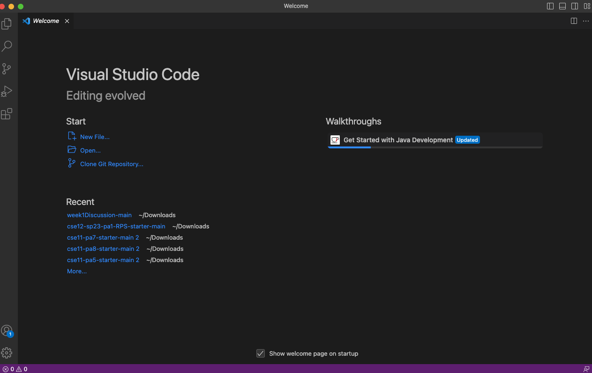

# Lab Report 1
## Installing VS Code
1. Go to the Visual Studio Code Installation website - [https://code.visualstudio.com](https://code.visualstudio.com/)
2. Follow the installation instructions carefully for your specific operating system (Windows/PC or Mac)
    - **For mac users**, make sure it shows up as an application in your Finders application folder(see below)
    - 
3. Launch a new VSCode window after installation and make sure it looks something like this --> 
    -      

## Remotely Connecting  
### We can use the VSCode terminal to connect remotely to a computer in the CSE basement in order to access course-specific content.
1. With a new VSCode window open, open a new file with a name of your choice.
2. Navigate to a new terminal by clicking the terminal drop-down menu where you will see *New Terminal* listed. Should look like this --> 
      - 
      - **Make sure you are using a "bash" terminal**
3. Using your course-specific account name, enter this code into the terminal -->
    ```
    $ ssh cs15lsp23kd@ieng6.ucsd.edu
    ```
    
    ```
     $ ssh cs15lsp23##@ieng6.ucsd.edu
     ```
     **Replace the ## with your course-specific account & Remember to not add the $ when typing in the terminal**
4. You will most likely get an error message the first time, followed by a confirmation to continue connecting --> type *Yes* & press Enter
5. Enter your password and press enter.
      - **Forgot Password? Go to this link to reset password with your associated ieng6 account** -- [https://sdacs.ucsd.edu/~icc/index.php](https://sdacs.ucsd.edu/~icc/index.php)
  - This is the expected output --> 
### Congratulations! You are now connected to a university computer in the CSE building basement!!

## Trying Some Commands
1. There are a couple of commands you can try once you are in the remote server! Try typing any of these commands into the terminal to see the output --
      - The first & second command changes the current working directory to your home directory ( '~' is short for home directory)
      ```   
      $ cd ~
      ```
      ```
      $ cd
      ```
      - The below command will list all the files in your current directory, including hidden files, in long format, sorted by last modified time in descending order
      ```
      $ ls -lat
      ```
      - With '-a', the output will list all files, including hidden files, whose name begins with a dot,'.'.
      ```
      $ ls -a
      ```
      - "pwd" stands for print working directory
      ```
      $ pwd
      ```
      - "mkdir" will create a new directory (usually followed by the directory name) in the current working directory
      ```
      $ mkdir
      ```
      - "cp" is short for copy; it will copy all files from one location to another (scp stands for secure copy)
      ```
      $ cp
      ```
2. To exit the terminal --> Ctrl-D or run the below command 
```
$ exit
```
### Example of running a command in terminal of your remote server:
1. After entering my course-specific account email (ending in @ieng6.ucsd.edu) & password, I am able to run commands in the remote server now
2. "cd" & "cd~" do not change anything as I am already in the home directory
3. "ls-lat", as mentioned above, will print all files starting with a dot
 
   
