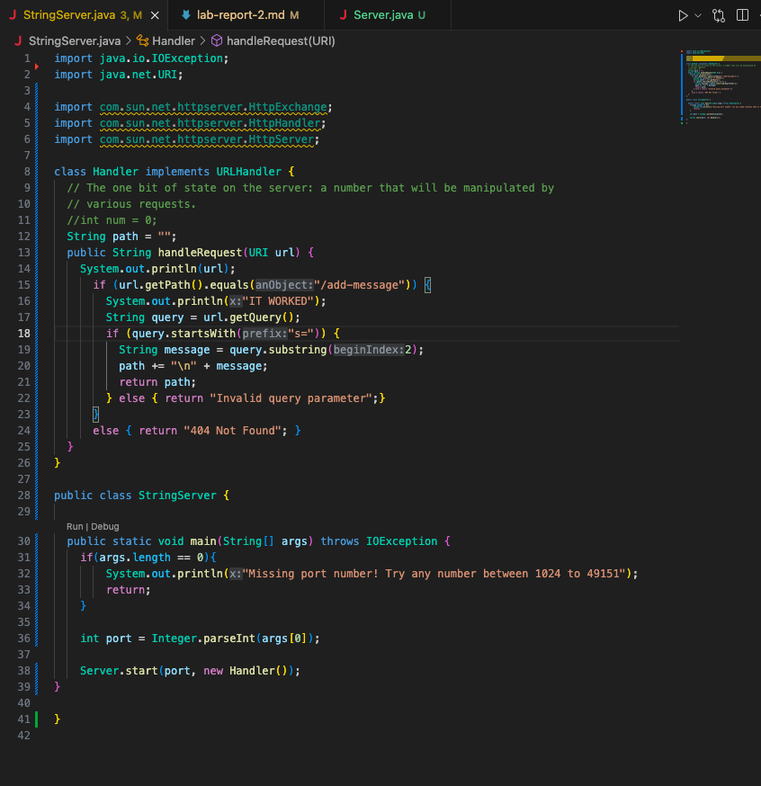
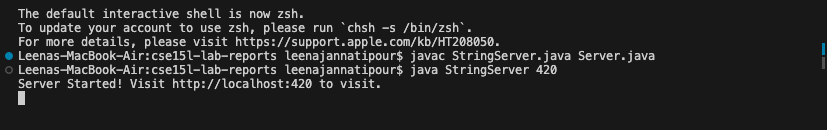
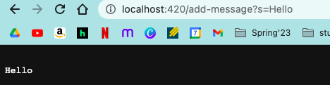
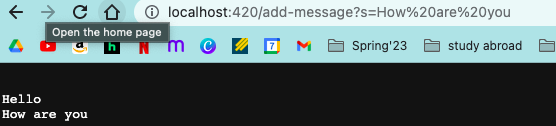

# Lab Report 2
### StringServer.java code:


### StringServer Bash Input:



### StringServer Add-Message Execution 1:

- Line 15 of the above code was the first to be called via the Handler class with the handleRequest(/add-message?s=Hello) as the method argument
```
if (url.getPath().equals("/add-message") { 
```
- In this if statement, the query variable is created
```
String query = "/add-message?s=Hello".getQuery();
```
- The next if statement (line 18) is also initiated
```
if (query.startsWith("s=") {
```
- In this nested if statement, the message variable is created and added to the path in a new line, then returned
```
String message = "Hello"
path += "\n" + "Hello"
```
### StringServer Add-Message Execution 2:

- Line 15 of the above code was the first to be called via the Handler class with the handleRequest(/add-message?s=How are you) as the method argument
```
if (url.getPath().equals("/add-message") { 
```
- In this if statement, the query variable is created
```
String query = "/add-message?s=How are you".getQuery();
```
- The next if statement (line 18) is also initiated
```
if (query.startsWith("s=") {
```
- In this nested if statement, the message variable is created and added to the path in a new line, then returned
```
String message = "How are you"
path += "\n" + "How are you"
```
## Part 2 - Lab 3 Bug
- There is an error in the reverseInPlace(int[] arr) method inside ArrayExamples.java
```
public class ArrayExamples {

  // Changes the input array to be in reversed order
  static void reverseInPlace(int[] arr) {
    for(int i = 0; i < arr.length; i += 1) {
      arr[i] = arr[arr.length - i - 1];
    }
  }
 ```
- This will result in incorrect ordering via this line of code
```
arr[i] = arr[arr.length - i - 1];
```
- I would instead implement a while loop and assign a temp. variable to swap the elements

## Part 3 - Week 3 Lab Reflection
- Something I learned in Week 3 Lab is that you can add a path or query from the server address and you do not have to rewrite the whole address in bash terminal with the path written. This saved me a lot of time once I found out.
