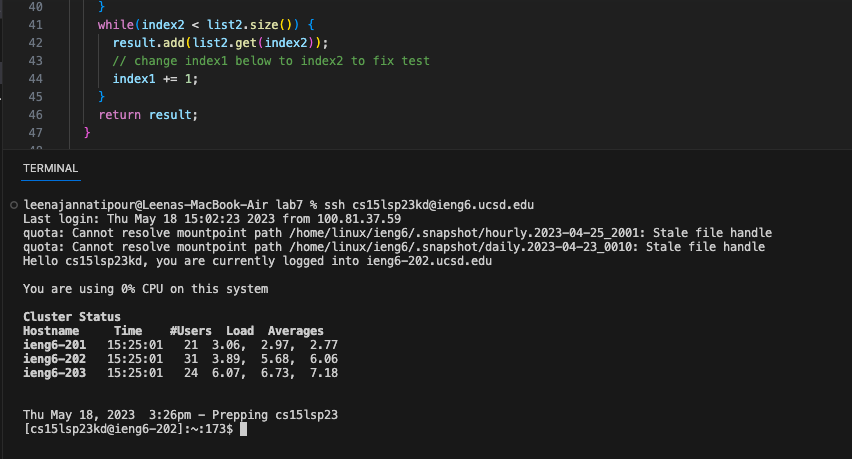
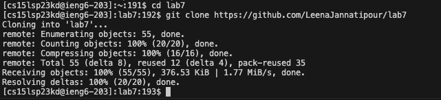
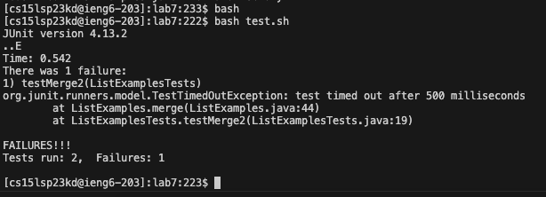
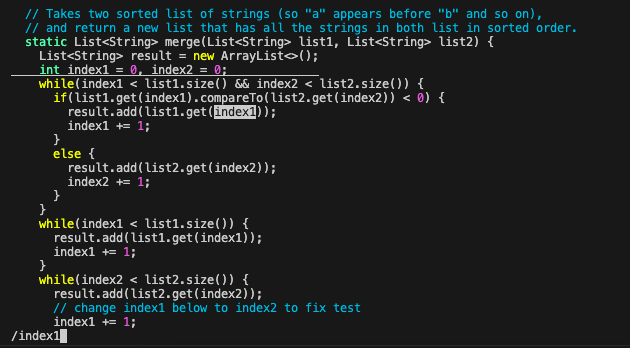
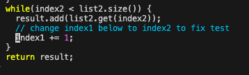
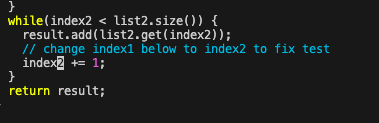
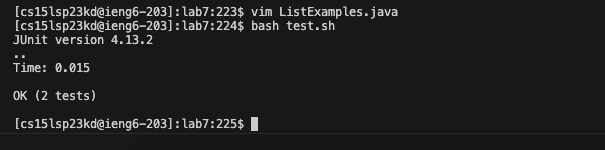
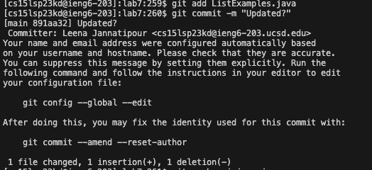
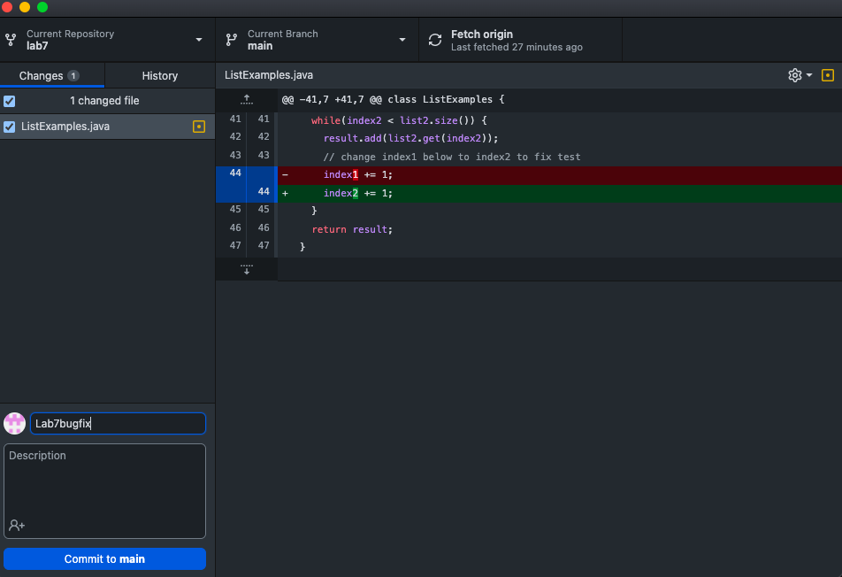

# Lab Report 4
## Using Vim to edit Java files
### Logging into ieng6
- Open Lab 7 repository in VS Code via Github Desktop
- Open a new bash terminal and input your ieng6 remote server account & press Enter
```
$ ssh cs15lsp23kd@ieng6.ucsd.edu
```


### Clone your fork of the repository from your Github account
- Once you are in ieng6, change the directory to lab7 + press Enter
```
$ cd lab7
```
- If you have not deleted your past fork of the repository, use the following command:
```
$ rm -rf lab7
```
- Then, clone your fork of the repository from the command line + press Enter
```
$ git clone https://github.com/LeenaJannatipour/lab7
```


### Run the tests, demonstrating that they fail
- Before fixing the bug in the code, we run the JUnit tests & press Enter
```
$ javac ListExamples.java
```
```
$ bash test.sh
```


### Edit the code file to fix the failing test
- To edit the code in the terminal, we can use vim to edit the ListExamples java file 
```
$ vim ListExamples.java
```
```
<Enter>
```
- Once in vim, we can search for the bug and edit it accordingly
```
/index1
```
```
<Enter>
```
```
<n> <n> <n> <n> <n> <n> <n> <n> <n>
```
```
<l> <l> <l> <l> <l>
```
```
<x> <i> <2> <Esc>
```




### Run the tests, demonstrating that they now succeed
- After saving the vim file, we can run the JUnit test file again
```
<Shift + ;> <w> <q> <Enter>
```
- To verify the change to effect in the ListExamples file
```
$ cat ListExamples.java
```
```
$ bash test.sh
```



### Commit and push the resulting change to your Github account
```
$ git add ListExamples.java
```
```
$ git commit -m "Updated?"
```
```
$ git push origin ListExamples
```


