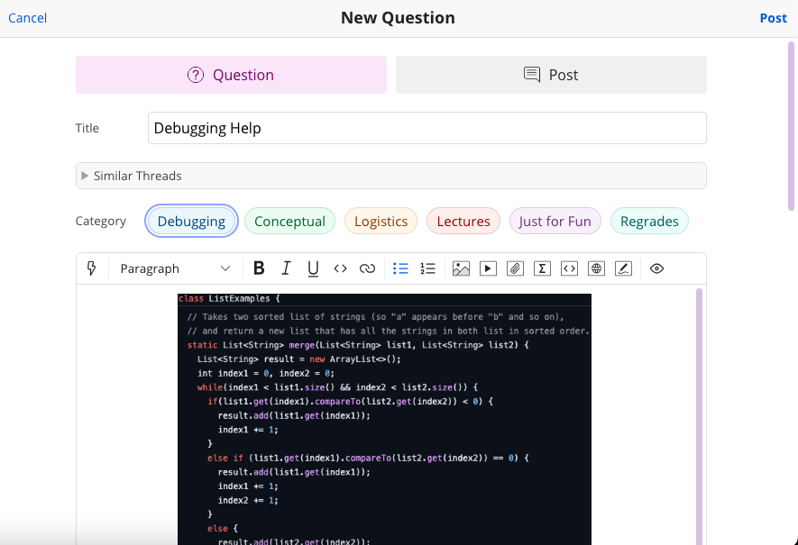
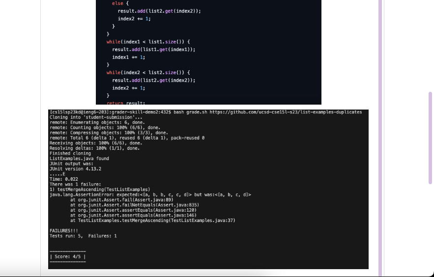
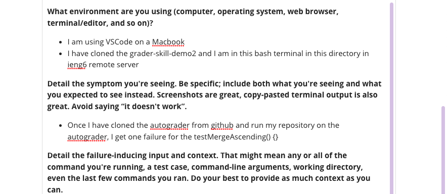
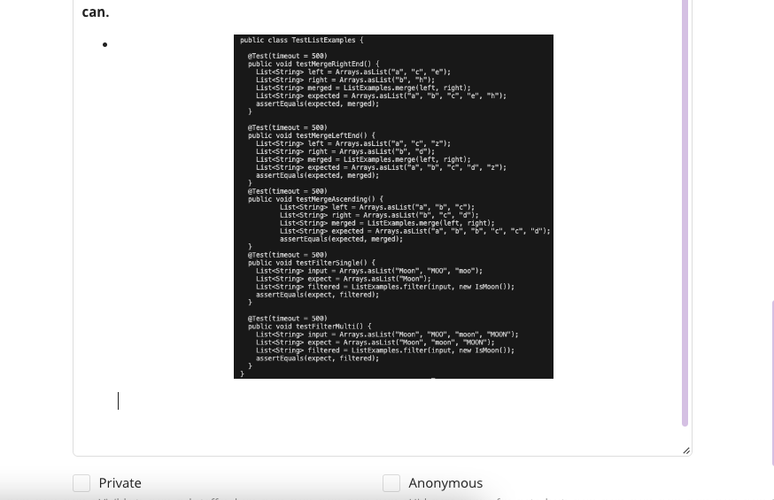
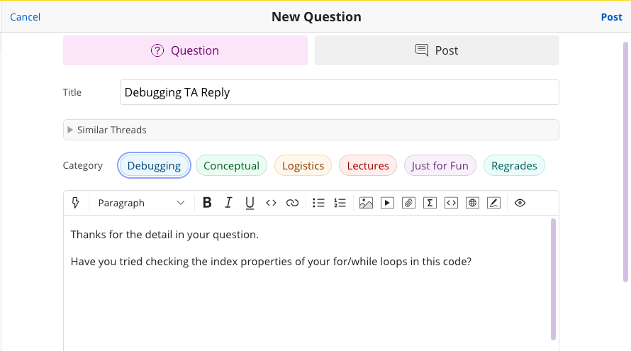
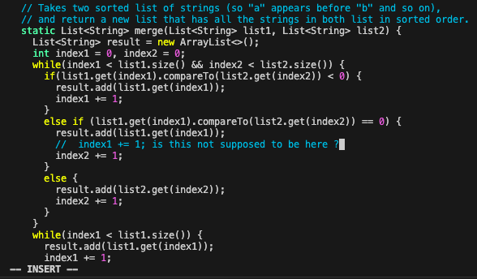
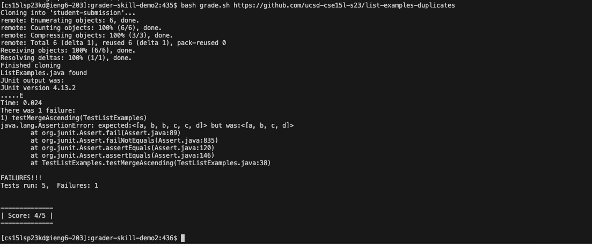
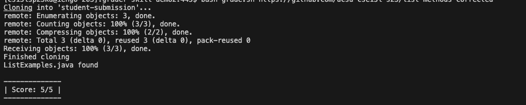
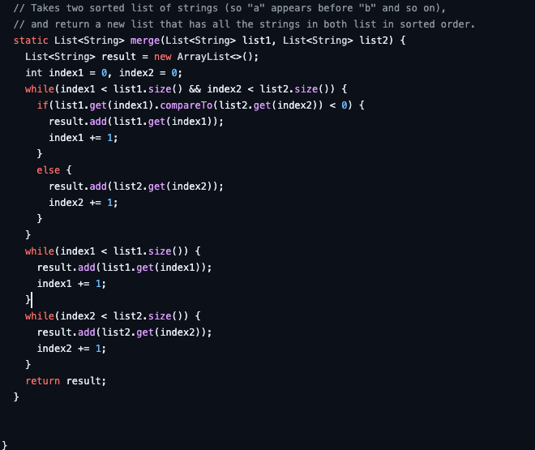

# Lab Report 5
## Part 1:Debugging Scenario
### Student Debugging Question

### TA Response

### Student Response

- I see that now my code does not accept duplicates. 
- After removing the unnecessary else if statement in the while loop, my code passes.

- This is what my corrected code looks like

## Part 2:Reflection
- During the second half of the quarter, this lab taught me about vim and how to edit a file in the command line of a terminal. This was very useful as you can debug and run your code whilst staying in the terminal the entire time. Also, the TA's gave me hope in finding an internship this summer as they have all gone on to be successful in their career!
